# Games backlog

Website for tracking your backlog of PC video games available on Steam.

## Check it on Render:
### https://games-backlog.onrender.com/

### Note:
Database on Render limited to 5000 instances.

## Technologies
Django  
Dkango ORM  
Postgres  
On-render  

## Test credentials 🔓
Username: Test_User_01   
Password: zmPz>G$swe+s/;23

Username: Test_User_02   
Password: zJB8pscIY0vK*KT1

Username: Test_user_03   
Password: mBnQN5ejDKuv2C4

## Credits

- Soft UI Design System for a perfect template: [GitHub Repo](https://github.com/app-generator/django-soft-ui-design)
- RDNE Stock project for background: [Pexels](https://www.pexels.com/photo/a-woman-playing-a-video-game-7915289/)
- Leinstay for a great Steam games database: [GitHub Repo](https://github.com/leinstay/steamdb/)

## Database diagram

Note: categories are for further extension of site.

## Features

1. **Great index page thanks to the template.** 
   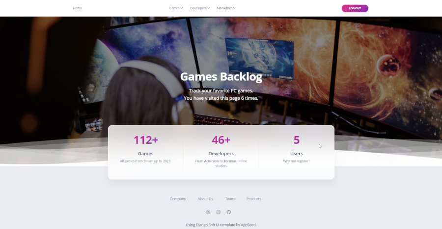

2. **Game list with user level separation.**
   Staff users can update/delete games via the site interface: 
   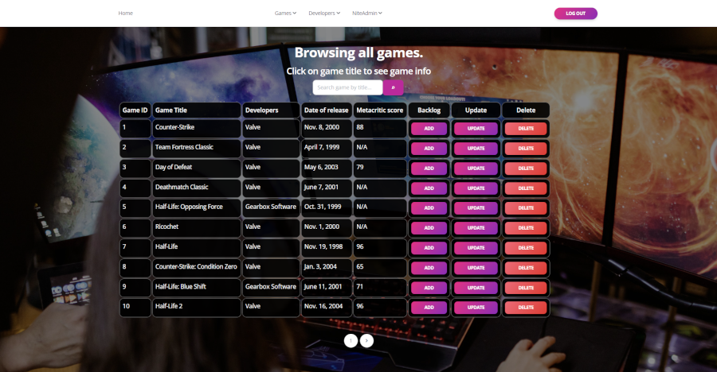 
   Ordinary users can only add games to the backlog: 
   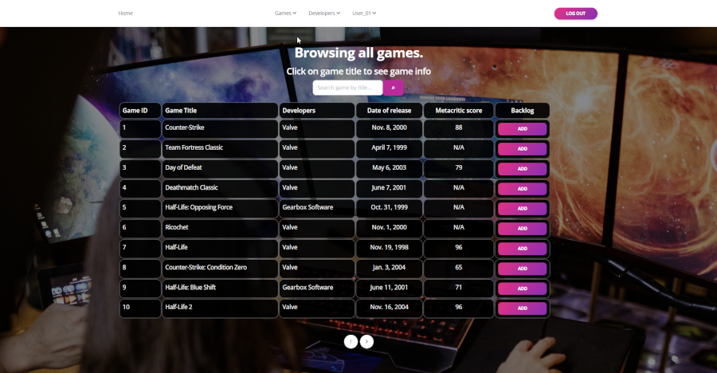 

3. **Same applies for developer and user views.** 
   Staff can update/delete developers. 
   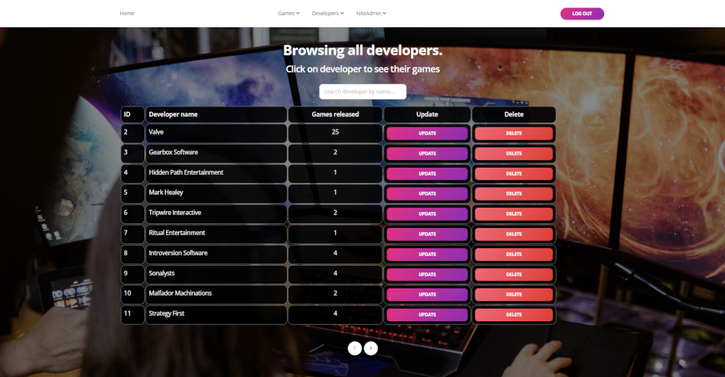 
   Ordinary users can only view the developers list. 
   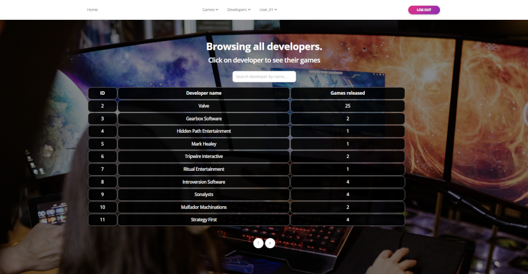 

4. **Superuser can create/delete a user via the site interface.** 
   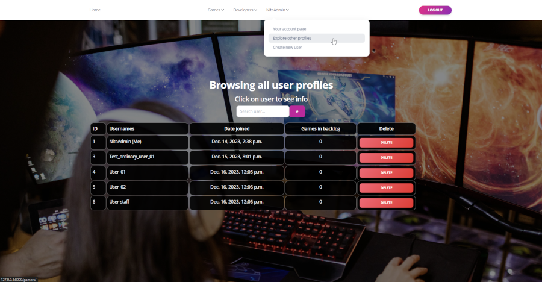 

5. **Staff users have no permissions for user creation.** 
   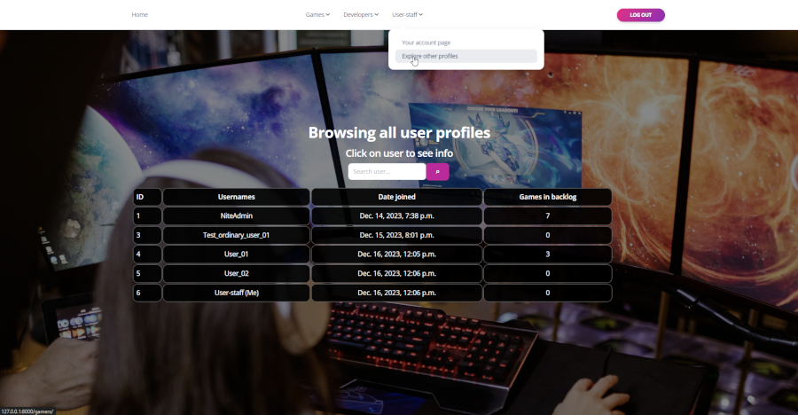 

6. **As you can notice, the drop-down menu is customized according to the user's permissions level.**

7. **Paginated search for games, developers, and users.** 
   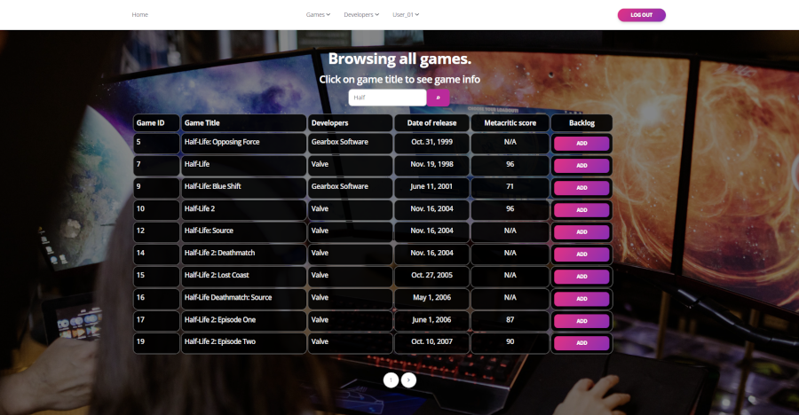 

8. **User actions**
   Users can add games to their backlog to monitor completed games. 
   If a user can't find a game, they can add it via the drop-down menu "Games->Add game." 
   Users can add games to their backlog via the game list or game detail pages: 
   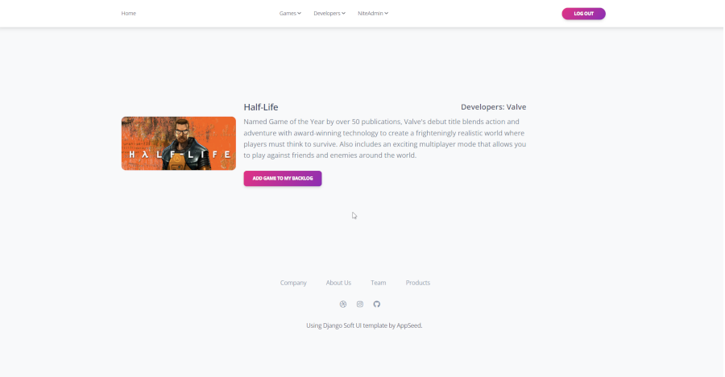 
   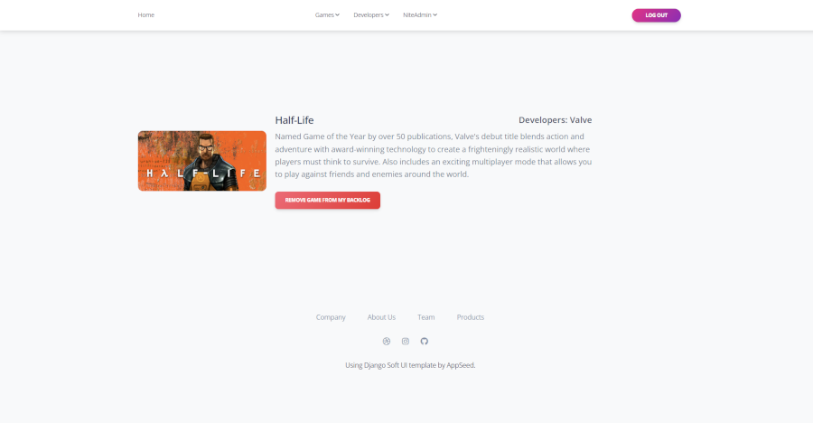 
   Users can view their/other users' backlog on the account page. 
   User viewing their own page: 
   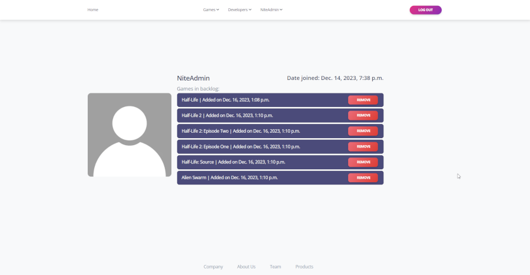 
   User viewing another user's page: 
   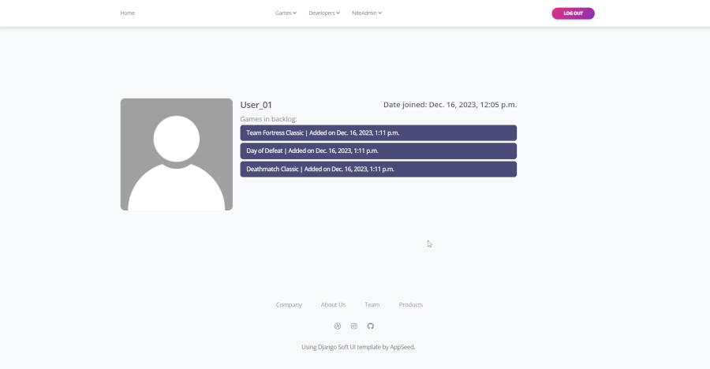 

9. **Creation forms** 
   **Game:** 
   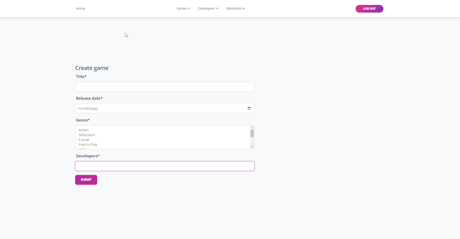 
   **Developer:** 
   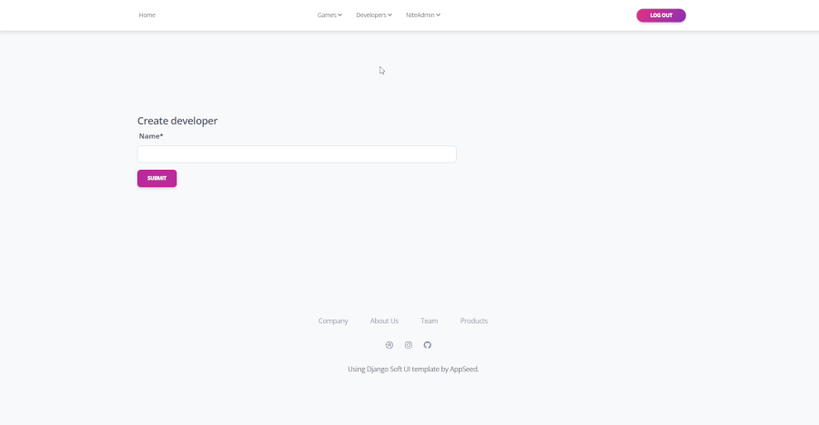 
   **User:** 
   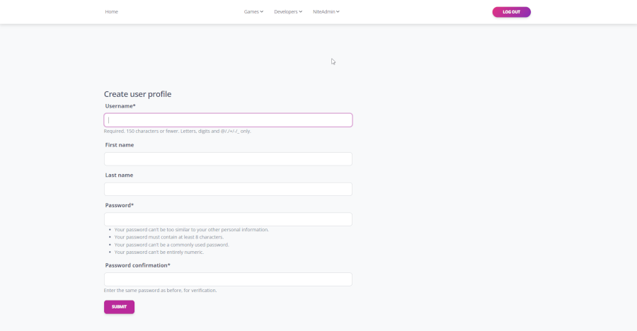 

10. **Additional logic**
    Data in JSON format similar to Leinstay's database can be added via:  

> python manage.py importdata

11. **Testcases for Forms, Models and Views**  
12. **Additional view for TOP 10 GAMES by Metacritic score.**  
13. **All site views are class-based views.**  
